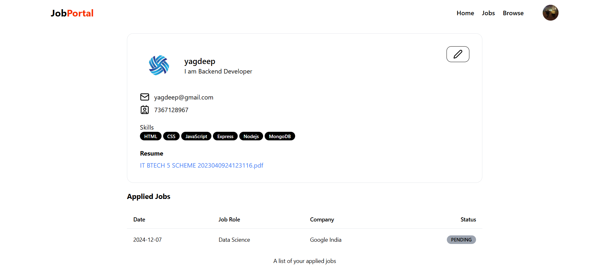

# Job Portal Web Application

## Overview
The Job Portal Web Application is a full-stack platform designed for job seekers (students) and employers (recruiters). The platform allows students to browse and apply for job opportunities, while recruiters can post job listings, manage applications, and track student status. The application includes features such as user profiles, resume uploads, job applications, and job listing management.

## Features

### Student Features:
- **Home Page**: Displays a list of available job opportunities, featured jobs, and quick links to other sections.
  
  

- **Job Page**: Allows students to browse job listings, filter by job type, location, and required skills.

  
  
- **Browse Page**: A page to explore companies and job categories.
- **SignUp Page**: First to sign up account for use this application.

  
  
- **User Profile Page**: Students can create and manage their profile, upload resumes, add skills, and update personal information.
- **Job Application**: Students can apply for jobs directly from the job listings page by submitting their resumes.

  

### Recruiter Features:
- **Company Page**: Recruiters can create and manage their company profiles, add company details, and view their posted jobs.
  
  
  
- **Job Page**: Recruiters can post new job listings, including job title, description, location, and required skills.

  
  
- **Student Status Page**: Recruiters can view students who have applied for their jobs and manage application statuses.

## Technologies Used

- **Frontend**: React.js, Tailwind CSS, Shadcn/ui
- **Backend**: Node.js, Express.js
- **Database**: MongoDB
- **Authentication**: JSON Web Token (JWT)
- **File Upload**: Cloudinary for resume uploads

## Installation

To set up the application locally, follow these steps:

### 1. Clone the Repository
```bash
git clone https://github.com/your-username/job-portal.git
cd job-portal
```
### 2. Install Packages
```bash
npm install packages_name
